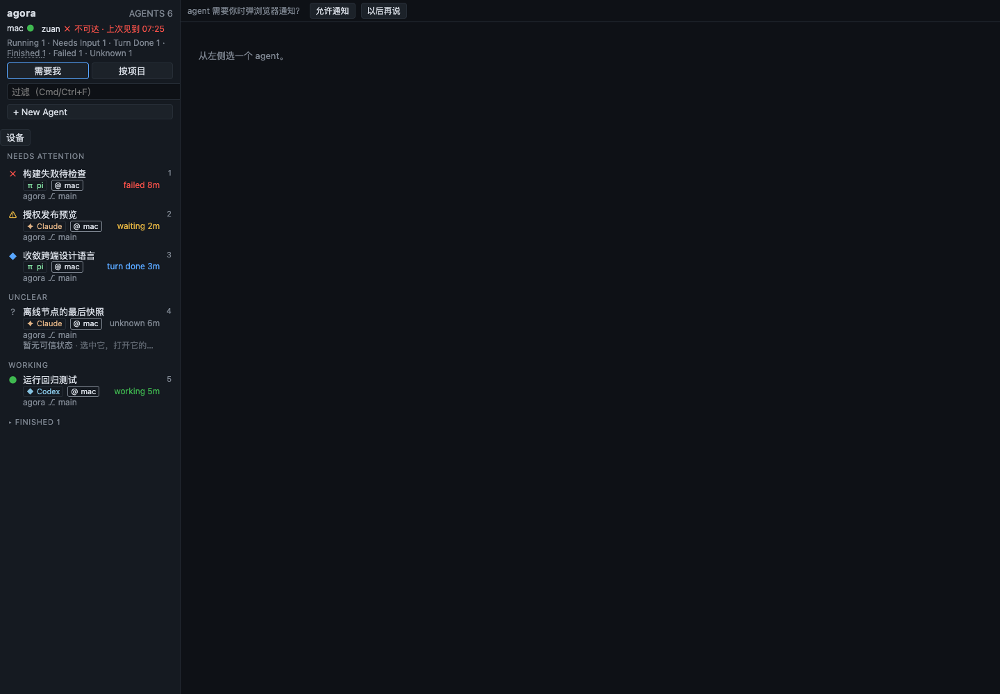
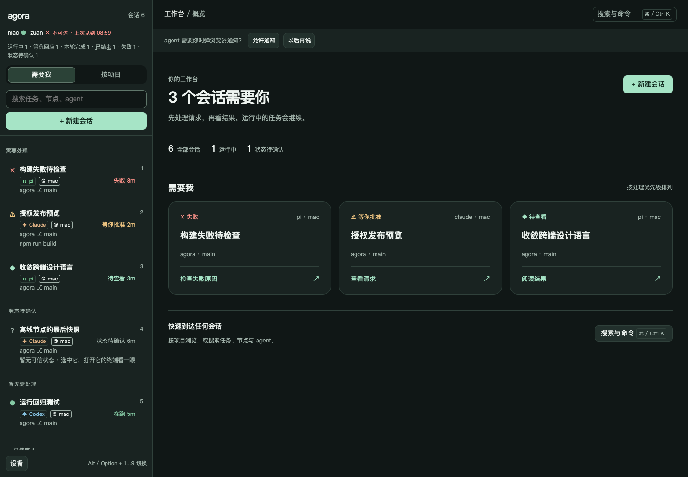
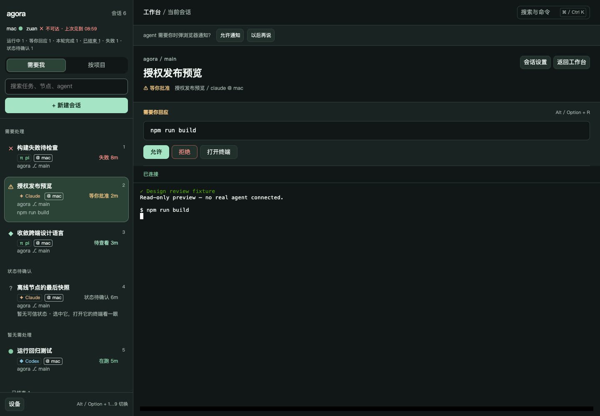
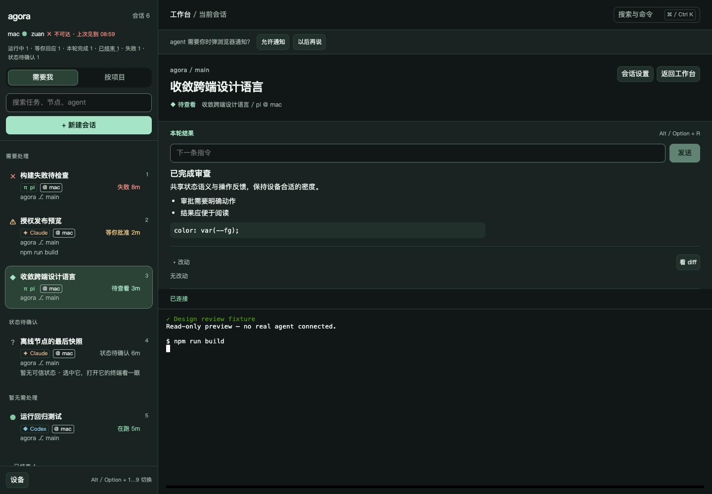
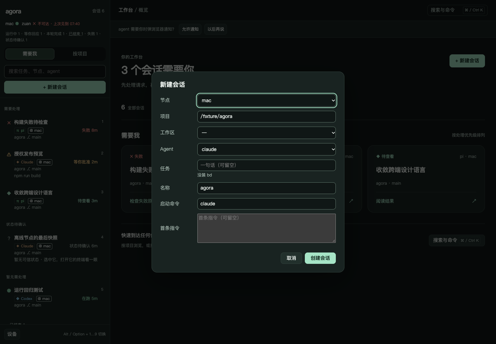

# 桌面 Web UI/UX 审查与重设计

2026-10-09 · agora-p7p0。审查对象为仓库桌面实现与 agora-d0r 手机重设计；本次已实现桌面重设计、共享 token 与 agent 规范。所有截图使用隔离的六会话 API fixture，不包含真实会话，不代表部署到生产。

## 结论与依据

首要问题是决策顺序不清楚：旧桌面把节点、七类计数、搜索、创建和设备入口集中在 260px 侧栏，首次打开主区只有一句「从左侧选一个 agent」。它要求用户先解读列表，再决定做什么；手机的新收件箱已经把待处理事项与下一步动作放在前面。

| 审查发现 | 证据 | 决策与本次实现 |
|---|---|---|
| 首屏缺少下一步，主区空白 | 下方旧版截图；`Workspace.tsx` 原空态 | 待处理概览使用同一 attention/已读/新鲜度判据；卡片直接选中会话，无新页面或第二套选中状态 |
| 存在 token 却没有跨端统一 | 原 `:root` 同时有蓝灰与 mobile 墨绿两套值；手机壳覆盖语义变量 | 统一墨绿表面、薄荷动作、琥珀请求、珊瑚危险；设备仅保留密度差异 |
| 入口竞争、长列表会让工具离开视野 | 原 Sidebar 同一滚动容器同时承载标题、创建、设备与所有行 | 顶部操作固定、列表独立滚动、设备入口固定底部；侧栏默认 320px，用户既有宽度保留 |
| 状态词与分组易误导 | 桌面 WORKING 包含已读 TURN_DONE；手机已有「暂无需处理」 | 可见分组用中文，行复用手机状态文案；已读经 `seenKey` 传入，状态枚举/排序/清理范围不变 |
| 任务身份、操作与阅读缺少层级 | 原 crumb 一行拼接，普通按钮同等权重 | 新会话标题与环境身份分层；回应区有标题，允许/发送突出，拒绝保留危险语义；回复 14px、1.6 行高、76ch 宽度 |
| 控件与终端没有完整消费 token | 原 xterm 使用 TS 硬编码颜色/字号；根样式未统一键盘焦点 | xterm 从 CSS computed style 取值；增加字体/行高/焦点/控件/阅读布局角色；对比度与分叉守卫 |
| 旧行淡化会连可读文字一起压暗 | stale / done 整行 opacity 0.55 | 降低标题层级、保留明确 stale 信息，不再把整行文字透明化 |
| 弹窗缺少统一键盘边界 | 原创建/命令框局部 Escape，设备/确认框无共同焦点管理 | 共享 `useDialogFocus`：Tab 循环、Escape 关闭、返回触发控件、嵌套确认仅最上层响应 |
| 长标题与长结果会挤压终端 | 700×700 的 DOM 长文本探针中标题/面板合计过高 | 标题两行省略并保留全文 title；回应/结果面板可收缩滚动，终端设视口相关最小高度 |

## 第一性原理与界面方案

一次会话管理的成本包括找到目标、理解情况、决定下一步、执行以及确认结果。设计要降低这五步的成本，而非追求控件数量最少或机械复刻手机。

桌面骨架仍是两栏：左边定位、右边处理。未选中时右侧展示需要人的任务；选中后换成该任务的标题、回应/结果与终端。快捷键、项目树、稳定排序、原始权限命令、审批 request_id、已读边界以及 detach 语义全部延续。普通运行会话不争夺待处理卡片的位置。主区按钮可见可点，键盘用户仍走原有快捷键。

不增加仪表盘图表、装饰性统计或第二排会话标签；概览数字只回答有多少工作需要关注。桌面正文 14px，手机默认 17px；桌面常用控件 32px、粗指针 44px，手机随字号至少 44px。这些差异来自阅读距离、可用面积和输入精度；颜色与状态含义没有设备差异。

设计系统的长期契约见 [design-system.md](../spec/design-system.md)，已从 `AGENTS.md` 和 spec 索引链接。旧的字号/几何微调不机械全部 token 化；新增代码使用语义角色和间距档位。

## 视觉对照

旧版首页：

重设计首页：

权限请求：

结果与终端：

创建会话：

## 验证与限制

使用 agent-browser 0.37.1，独立 session `agora-p7p0` / `agora-p7p0-final`，Vite 指向 loopback 隔离只读 fixture；最终浏览器验证使用生产构建的 preview。fixture 拒绝所有非 GET 请求，没有真实 daemon、tmux 或宿主输入。浏览器验证检查呈现、导航和几何量；审批/发送/创建的真实接口契约由既有测试验证，不能把模拟预览说成生产端到端验收。

主要命令为 `agent-browser --session agora-p7p0-final open http://127.0.0.1:5179/`、`set viewport`、`snapshot -i`、`click`、`press Shift+Tab` / `press Escape`、`eval` 读取 computed style / DOMRect / scrollWidth。开发时的旧错误缓冲不当成最终结果；新的 production preview session 单独检查 errors。

| 代检 | 观察结果 |
|---|---|
| 桌面 1440×1000 / 1024×768 / 700×700 | 页面 scrollWidth 分别为 1440 / 1024 / 700；侧栏与主区独立滚动，无页面横向溢出 |
| WAITING 与 TURN_DONE | 原命令可读，允许/拒绝与发送有明确层级；正文 computed font-size 14px；终端与页面底色同为 rgb(16,23,22) |
| 项目树、创建、设置与返回 | 入口可达；创建框在 1440px 视口为 560px 宽；返回概览只切换视图，交互协议仍受 Workspace 测试保护 |
| 创建弹窗键盘 | Shift+Tab 从首控件回到末控件，focus-visible 为 solid；Escape 后 dialog 消失、焦点返回 `.new-agent.primary`，地址未变 |
| 手机 402×874 | 页面宽度 402；共享背景和 accent；搜索输入 16px |
| 手机 320×640、特大字号 | 页面宽度 320；阅读字号 22px；主要导航/筛选按钮约 57.19px，无横向溢出 |
| 700×700 长文本压力探针 | 640 字任务标题与长环境名注入渲染 DOM 后，页面仍为 700px；标题高约 67.19px，终端仍有 180px，面板收缩为约 179.42px 并可滚动 |
| 守卫反证 | 临时降低 muted 对比度并在 mobile 壳覆写 accent：恰好两条 token 契约红；恢复后 7/7 通过 |

本轮没有在实体 iPhone 上重新验 PWA、软键盘或系统通知，也没有把浏览器自动化当作 OS 保留快捷键的证据；原有验收记录仍在 UX 规格中。截图是确定性样本，主观视觉满意度由用户判断。用户已授权提交、推送与同步 Beads；提交证据记录于 agora-p7p0。

本地门禁：前端 50 个测试文件、511 项通过；`npm --prefix web run typecheck`、`npm --prefix web run build` 通过；`cargo test` 732 项通过，`cargo clippy` 通过；`scripts/doc-lint.sh` 0 个问题；`git diff --check` 通过。生产构建 preview 的独立浏览器 session errors 为空。构建仍提示单个 bundle 超过 500kB，未引入新依赖。
